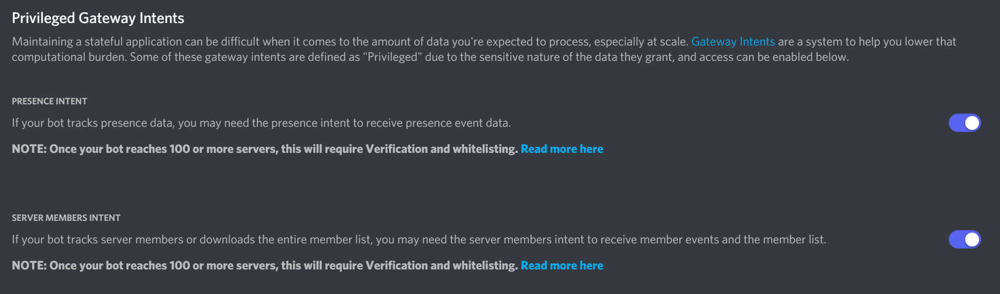

# YueJS

## About

This is a JavaScript rewrite version of my Discord bot Yue. Yue was using in NCU CSIE Discord Server and World of Warships guild PTT NiceBoat. It made so much fun. But the library used by Yue is no longer maintance([detail](https://gist.github.com/Rapptz/4a2f62751b9600a31a0d3c78100287f1)). In fact, the origin one which written by Python might not work properly in the soon future, so I decide to write a new one with [discord.js](https://github.com/discordjs/discord.js/).

## Installation

**Node.js 16.6.0 or newer is required.**

### Clone The Repository

```shell
git clone https://github.com/ppodds/YueJS.git
cd YueJS
npm install
```

If you encounter error, try to use docker to deploy your bot.

### Configure Config Files

config files at `src/config`

bot-config.json

```json
{
    "name": "Bot name",
    "statusList": ["a", "list", "of", "status"],
    "statusType": "Bot status type, either 'PLAYING', 'LISTENING' or 'WATCHING'",
    "token": "your token. you can get it on Developer portal",
    "env": "dev or prod",
    "dev": {
        "clientId": "123456789",
        "guildId": "123456789"
    },
    "author": {
        "avatar": "author avator url"
    }
}
```

db-config.json

```json
{
    "host": "localhost",
    "port": 3306,
    "user": "Yue",
    "password": "test",
    "database": "Yue"
}
```

Note:
Change `"host": "localhost"` as `"host": "database"` if you are using docker!

### Prepare Database

You need to install [mariadb](https://mariadb.org/download/) and sure it could work properly.

Note:
There is a `docker-compose.yml` can build a test database service in few minutes.

### Run Bot

Before you run the bot, you should deploy commands first.

```shell
npm run reg
```

Note:
`env` in `bot-config.json` affacts the process of deploying commands. If `env` is `prod`, `npm run reg` would deploy commands globally.

Now you can use `npm run start` check whether it can work.

Note:
If you get this error

```
Privileged intent provided is not enabled or whitelisted.
```

Try to enable options below


## Deploy

### Docker (Recommended)

Run following commands.

```shell
cd YueJS
docker build --tag yue .

# database is not in the container
docker create -it -v ./temp:/app/temp --network=host --name yue yue
# database is in the container
docker create -it -v ./temp:/app/temp --name yue yue

# run container!
docker start yue
```
